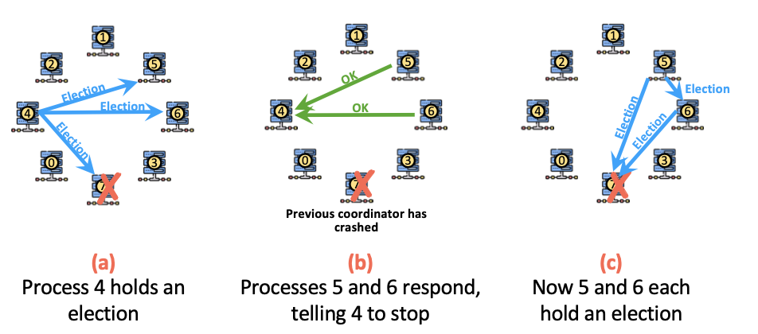
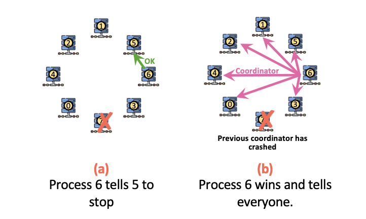
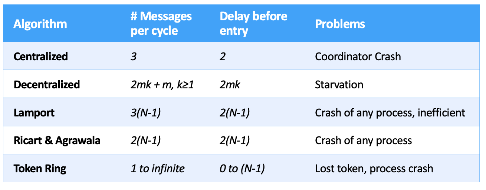

# CMU-15/440 Distributed Systems 4: Mutex

> 分布式系统课程15-440学习笔记4，这一节主要讲分布式系统中的**Mutual Exclusion**问题

## 互斥

互斥(**Mutual Exclusion**)是分布式系统的关键设计点之一，我们需要保证在每个时刻只有一个代码实例可以访问临界区。互斥需要保证系统具有：

- 正确性/安全性，即上面说的每个时刻最多只有一个进程可以获得访问临界区的锁
- 公平性，任何发出请求的进程都必须有机会获得访问临界区的机会，不能出现饥饿现象

## 中心化的互斥

### 基本模型

在中心化的互斥实现方法中，需要有一台机器作为**Coordinator**，它负责维护一个请求队列，并根据在当前锁被上一个进程释放的时候，将这个锁重新分配给队列最前面的那个进程

### Leader选举

但是很多时候，分布式系统中没有专门的Coordinator，或者Coordinator会出现fail的情况，这个时候就需要从分布式系统的进程中**选举**出一个合适的进程作为Leader，这个过程可以分为这样两个步骤：

- 步骤1，进程P发现原本的Leader出现了fail，需要重新选举
- 步骤2，Bully选举算法：
  - 进程P会给每个进程发送`ELECTION`的信息，告知它们需要进行选举，并在信息里面放一个比较大的数字作为identifier
  - 如果没有进程回答，那么P就自动获胜并成为Coordinator
  - 如果有进程回答了这条信息，并附上了更大的identifier，那么Coordinator就让它来当。总的来说，Bully算法就是选举出identifier最大的进程作为新的Coordinator

但我们总需要一个进程出来充当Coordinator，所以这种互斥的实现方式是中心化的。

## 去中心化的互斥

去中心化的互斥是另一种互斥的实现方式，它的特点是：

- 每个进程都是一个Coordinator
- 并且当一个进程需要访问临界区的时候，会向所有的Coordinator发送信息并等待回复，Coordinator回复的结果只有GRANT或者DENY
- 当进程收到半数以上的GRANT之后，它就可以访问临界区
- 如果收到的GRANT不足半数，那么进程就会在一段时间后重新尝试

这种方式通过投票保证了安全性，但也存在饥饿的问题，一些节点在崩溃重启之后可能会出现忘记投票的情况。

## 分布式的互斥

### 全序组播Totally-Ordered Multicast

全序组播是一个所有发给接受者的消息都以相同的order发送的组播操作，总的来说，全序组播算法的总体步骤如下：

- 发送出去的消息上面记录了发送者的时间戳
- 消息被以组播的形式发送出去(发送者自己也会收到)
- 当消息被接受的时候，接受者会：
  - 把消息放到本地的队列中
  - 根据时间戳进行排序
  - 接受者通过组播发送ACK信息

而一个消息只有在处于队列头部或者已经收到了所有的ACK之后，才会被发送给原本的应用，这种做法的好处是：

- 如果我们要收到一个ACK，那么我们必须已经收到所有来自这个节点的，发送更早的信息
- 如果在ACK之前，节点收到了消息，那么队列会保证消息的顺序正确

### Lamport互斥

Lamport互斥算法是另一种互斥算法，它的特点有：

- 每个进程维护了一个进入临界区的请求的队列，队列按照请求的lamport时间戳来排序
- (**发送侧**)当一个节点i想要访问临界区的时候，它就会给包括自己在内的所有节点发送包含时间戳的请求
  - 之后它会等待来自所有其他节点的
  - 如果发给自己的请求位于队首并且所有的回复都已经收到了，那么就可以进入临界区
  - 在结束对临界区的访问之后，节点i会给所有的其他节点发送一个消息表示访问已经结束
- (**接收侧**)当节点收到别的节点i发送的请求的时候，会把这个请求存储到自己的队列里去，并用单播的形式发送一个包含时间戳的信息给节点i
  - 在收到释放的消息之后，它会从队列中移除这个请求

在整个过程中，如果分布式系统中有n个节点，那么进程i访问一次临界区需要发送n-1条请求，并收到n-1条回复，之后再发送n-1条释放消息

### **Ricart & Agrawala**互斥

Ricart & Agrawala互斥是对Lamport的进一步改进，主要有这样几点：

- 不访问临界资源的接收端(**Receiver uninterested in resource**)，在收到请求后直接给发送端回复一个OK消息
- 已经访问过临界资源的接收端，在收到请求之后直接不回复，而是将请求放到队列中
- 对于想要访问但是还没有访问临界区的接收端，在收到请求后，会将自己这边发送的请求的时间戳(之前也发给自己了)和收到的请求的时间戳进行比较，时间靠前的那个先处理。如果收到的请求的时间戳更靠前就回复一个OK信息，如果自己的更靠前，就把别的节点的请求放到队列中并不发送消息

总的来说，就是时间戳比较小(靠前)的那个请求会被优先处理，并且可以证明，这个算法可以保证互斥性，每个时刻只有一个进程可以访问临界区，并且不会出现死锁和饥饿现象。

### 令牌环互斥

令牌环互斥将进程(不同节点)组织成一个逻辑环，有一个令牌在这个环上传递，持有令牌的进程可以访问临界区。

这个方式看上去非常简单，并且可以保证互斥的正确性，因为只有拥有令牌的进程才能访问临界区，同时也可以保证公平性，因为令牌最多转一圈就会传递到需要访问临界区的进程上。

### 总结

对于以上五种不同的互斥算法，课程的PPT中进行了如下总结：

