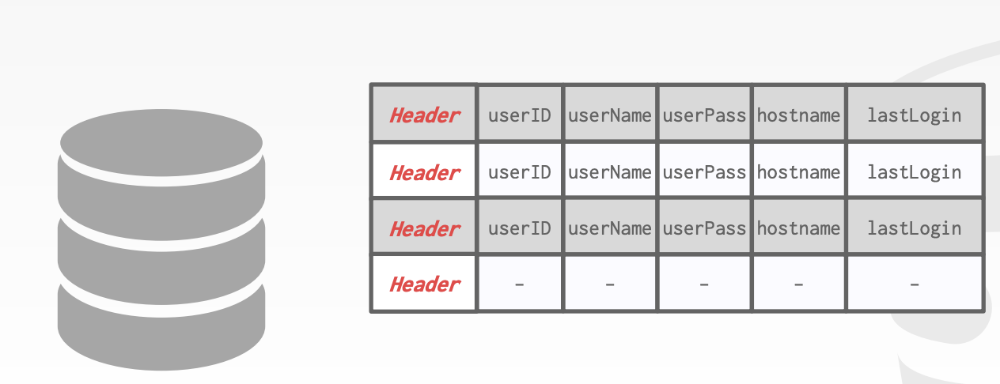
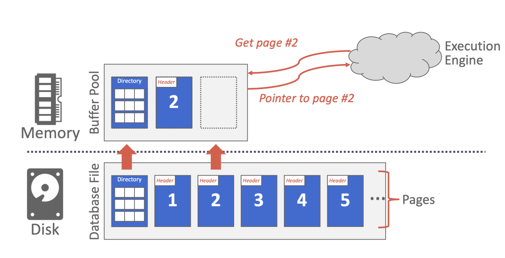

# CMU15-445-01：数据存储

> 15-445是CMU非常著名的数据库系统课程，本节内容是其中的数据存储部分的笔记。

## 计算机中的存储

CMU15-445的主题是数据库系统，实际上关键就是面向磁盘存储的数据库系统(特别是关系型数据库)，而数据库的存储的主要研究对象也是面向磁盘的数据库管理系统架构，所谓的面向磁盘存储就是说数据库中的数据存储在非易失性的磁盘中。

### 存储结构的划分

事实上计算机中的存储可以按照层级结构分成这样几个组成部分：

- CPU寄存器
- CPU中的Cache
- DRAM(动态随机存取存储器)，也就是通常说的内存
- SSD(固态硬盘)
- HDD(硬盘驱动器)
- 网络存储

这些存储器结构的访问速度从上到下依次降低，并且存在数量级上的差距，这也就很容易造成计算机中的IO失配。

同时存储结构又可以分成易失性存储和非易失性的存储。易失性的存储就是在关闭电源之后会数据会消失的存储，支持使用字节编址的快速随机访问，一般就称之为**内存**(不包括寄存器和CPU上的Cache，这两个属于CPU而不是存储器)。

而非易失性的存储可以在没有电源的情况下稳定存储数据，一般我们称之为磁盘(不区分SSD和HDD)，而磁盘上的数据是按照**块/页的结构**来编址和存储的(这里的块和页指的是同一个意思，后面就不再区分二者的关系)，访问的时候也需要将整个块(一般是4MB)读入内存中进行操作，因此磁盘更适合进行顺序访问。

> 另外还有一种非易失性的内存，既有DRAM的存取速度又可以像磁盘一样持久性地保存数据，不过这个不在这门课程的考虑范围之内，因为还没有被大规模商用。

因为内存和磁盘上的数据存取速度存在非常明显的数据集上的差距，因此数据库系统设计的一个很重要的点就是解决内存中的数据和磁盘中的数据的读写速度的失配，尽可能提高数据库系统的读写效率。

### 面向磁盘的DBMS

面向磁盘的数据库管理系统的总体运行规则是：数据按照块/页存储在磁盘中，当需要操作数据的时候，数据库管理系统会把对应的块/页读入内存中，同时在内存中维护一个**Buffer Pool(缓冲池)**来管理从磁盘读入内存的块。

同时数据库管理系统有一个执行引擎负责执行各种各样的查询，引擎会向Buffer Pool索要特定的块，然后Buffer Pool会从磁盘中将这个块读入内存，并将这个块在内存中的指针返回给数据库引擎，然后数据库

### DBMS和OS的比较

DBMS设计的初衷就是让用来管理数据容量超过内存的数据库(如果数据比较少，那好像直接全从磁盘上读入内存也不是不行)，它提供了一种类似于虚拟内存的机制来管理数据在内存和磁盘之间的读写。

虚拟内存的一种实现方式是`mmap`(内存映射)，这种方式可以将一个文件或者其它对象映射到进程的地址空间，实现文件磁盘地址和进程虚拟地址空间中一段虚拟地址的一一对应关系。但是这种方法一旦出现page fault就会让整个进程阻塞，因此我们在DBMS中不会使用mmap，DBMS总是希望能自己掌控所有的事务而不是依赖操作系统，因为它知道更多和数据/查询有关的信息可以充分利用。

但是DBMS可以通过如下几种方式来利用操作系统：

- `madvise` 通知OS你什么时候想要读取制定的块
- `mlock` 通知OS不要将某个内存区间和磁盘进行交换
- `msync` 通知OS将某个内存区间的东西写入磁盘

## 数据库文件存储

### 页Page

大部分DBMS都把数据作为磁盘上的文件进行存储，同时会用DBMS指定的方法进行加密，只有DBMS可以知道加密和解密的规则，而操作系统对此一无所知，这些功能都由DBMS的Storage Manager进行管理，Storage Manager将数据文件表示成若干个页的集合，并且会监测一个文件的页中还剩下多少空间可以使用。

同时每个页会有一个唯一的标识符(id)，如果一个数据库是单文件的(比如SQLite)，那么这个标识符就是文件的偏移量，如果是多文件的就更复杂一点。同时DBMS会将id映射到文件路径和偏移量，上层的执行引擎会索要指定id的页，这时候storage manager将会把这个id转换成文件和偏移量并找到这个页。

同时DBMS的页可以存储各种不同格式的数据，比如索引和元祖，但是不会将不同格式的数据进行混合存储，同时DBMS中的页是自包含的，一页所有的信息都在写在页内，只需要读取这个页就可以知道所有相关信息，而不需要依赖外部的数据结构。

DBMS中的页一般是定长的，往往选用和硬件页/操作系统页一样的大小，也就是4KB，这样方便进行读写(因为存储设备可以保证一个页的读写是原子操作，即要不4KB都写入，要不4KB都写入失败)

### Database Heap

堆文件(Heap File)是一种常见的页组织方式，可以让DBMS找到所需要的页在磁盘中对应的位置。堆文件中的页的信息是用元组格式进行无序存放的。

DBMS可以用以下几种方式找到page id在磁盘上对应的块：

- 链表：每个文件的header page中保留一个指向空闲页的指针和一个指向数据页的指针，页和页之间形成链表状的结构，这种方法的坏处是，如果DBMS想要找一个特定的页，那么它必须从header开始顺序扫描直到找到目标，比较费时间。

- 页目录Page Directory：DBMS维护一个专门的页用来记录每个页的数据页和空闲页的位置，跟map类似，用page id直接去查到对应的页位置。

### 页的存储格式(Layout)

每个页都包含了一个页头，头里包含了若干元数据，包括：

- 页的大小
- 校验和
- DBMS的版本
- 事务的可见性
- 自包含性Self-containment

头之后是页中的数据，一种naive approach是只是简单的记录一个页中存放了多少元组，每次有新的数据写入就在末尾添加，这样的做法会导致的问题是，如果数据被删除或者包含了不定长的字段，那么整个页的管理就会出现问题。常用的数据存储方式有两种，分别是slotted-pages和log-structured

> 我们需要搞清楚，在关系型数据库中，数据的基本形式是一个元组(tuple)，因此存储的时候也需要将元组作为一个完整的对象进行考虑。

#### Slotted-Page

这种方法将页中的剩余空间划分成若干个槽(slot)，用槽来存储不同长度的元组数据，同时页头中维护slot的数量，最后使用的slot的末端在页中的偏移量，和每个slot的在页中的偏移量，并且用一个**指针数组**存储指向各个slot的指针(称为slot array)

同时slot是从页尾开始往前存储的，而slot array从页头开始往后存储，每次加入一个元组的时候都在slot array末尾添加一个指针，可以用下面这张图来描述slot page的构建方式：

当一个元组被删除的时候，后面的元组会向前移动填补空缺(当然从整个页的角度来看应该是前面的元组后移，因为元组存放方向和页的方向是反的)，同时在slot和slot array碰头的时候，我们认为这个页已经被填满了，不能再往里面写任何新的元组。

#### Log-Structured

日志结构的存储方式是，不存储元组而是直接存储数据库的操作记录，将所有修改了数据库内容的操作用日志的形式进行记录(创建，删除，修改)，在查询一条记录的时候，DBMS会根据这些日志将元组中的数据进行“复原”，然后筛选出合适的结果，这样做的好处是写很快，但是坏处是读很慢，在append-only的场景下非常合适，因为这时候很少需要回过去修改数据。

为了避免在读的时候进行过长的操作，DBMS会维护一些索引方便直接跳转到某条日志记录进行执行，同时也会定期对已有的日志记录进行合并，减少重复工作量。

### 元组的格式

元组实际上就是用一串字节序列来存储关系型数据库中的一条记录，DBMS需要将记录转换成元组，也需要对元组进行解析得到正确的记录，元组的格式可以分成Header和Data两个部分，头部的内容主要是元数据，这些元数据对于DBMS的并发控制协议是可见的，可以使用bitmap来标注NULL值，并且不需要存储数据库中的Schema(因为每个元组都存太浪费空间了，DBMS对此有统一的管理)

而Data部分则是具体的属性值，属性值的顺序应该和数据库的Schema保持一致，并且一般来说长度不能超过一页的大小。

数据库中的每个元组都有一个独立的标识id，一般使用`page id+slot offset`组成

### 数据的表示

元组中需要存储的数据类型往往有以下几种，并且分别有各自的表示机制，元组可以对不同的数据格式进行解析：

- 整数：一般直接使用本地的C/C++中的IEEE-754标准进行存储
- 固定精度浮点数：一般直接使用本地的C/C++中的IEEE-754标准进行存储
- 任意精度数：需要用一个元数据存储其长度，然后再存储具体的数据
- 变长数据：用一个header来监控数据的长度(当作字符串存储)
- 日期和时间：一般用时间戳的形式才存储
- **系统目录(System Catalog)**：存储一些跟数据库有关的元信息，包括表的信息，表中每一列的信息(名字，数据类型等等)，数据库系统在启动的时候可能需要这些目录信息来“bootstrap”

## 数据库的存储模型

### 数据库的工作模式

数据库的工作内容可以分成这样几种不同：

- OLTP：Online Transaction Processing在线事务处理，执行一些短而快的运行操作，并且一般写数据比读数据的操作要多
- OLAP：Online Analytical Processing在线分析处理，执行一些长而复杂的查询，主要是对数据进行读和分析，写操作比较少
- HTAP：Hybrid Transaction + Analytical Processing混合事务和分析处理，是OLTP和OLAP的组合

### 常见的存储模型

元组在页中的存储有多种不同的方式。

#### N-Ary Storage Model (NSM)

前面提到的存储方式实际上都可以看成是N-Ary存储模型，这种存储模型将一个元组的所有属性存放在一个页中，因此也被叫做行存储，这种存储方式对于OLTP比较友好，因为OLTP需要进行频繁的插入操作，这时候按照行进行存储会方便一点，同时对于需要整个元组信息的查询，这种存储方式也使得查询速度更快。

但是这种方式也有缺点，如果我们的查询**只需要获得一部分元组中的属性值**，这种存储方式的效果就不太好，因为页中存储了所有的属性值，因此我们需要更多次读取不同的页来完成查询操作，实际上就是在说，行存储在只需要查询部分元组属性值的场景下会浪费存储空间

#### Decomposition Storage Model (DSM)

这种存储模型又叫做列存储，在每个页中只存储一系列元素的一个属性值，这种存储方式比较适合OLAP，因为OLAP需要大量的只读操作，并且往往不需要访问元组中的所有属性，因此使用列存储效率较高

而这种存储方式的缺点在于面对大量写操作(OLTP)的时候处理效率非常低

## 缓冲池Buffer Pool

数据库系统需要将磁盘中的数据加载到内存中进行读写，然后再将更新的数据写回磁盘中，这是一个back-and-forth的过程，因此数据库系统也需要对内存进行一定的管理，这种管理方式就是在内存中开辟一块缓冲池用来存放若干个从磁盘中读取的页

事实上缓冲池对磁盘中的块和内存中的页的控制可以分成时间上和空间上两个部分：

- 空间上的控制(Spatial Control)是指管理在物理存储上相近的块，让需要一起用的页所处的物理块在磁盘上尽可能相近
- 时间上的控制(Temporal Control)是指在合适的时间进行块的读写，目标是最小化所需要的读写次数

实际上这两个工作目标和计算机中的局部性(包括时间局部性和空间局不性)是一致的。

### 缓冲池是什么

缓冲池(Buffer Pool)就是数据库系统在内存中管理数据库页的一种方式，缓冲池实际上就是一个内存中的cache，并且由一系列固定大小的页组成一个数组，数组中的每一个条目(entry)叫做帧，在需要某个特定的页的时候，数据库系统会先从内存的缓冲池中找对应的页，如果找不到就去磁盘上将这个页读入内存中

#### 元数据的维护

每个页在缓冲池的帧中所处的位置可以使用页表来记录，在此基础上可以添加脏页标记(dirty-flag)和引用计数(pin/reference Counter)等元信息

#### 内存的分配策略

数据库系统的内存分配的原则包括

- 全局性原则：数据库系统的内存分配必须对整个工作流程中的事务处理都有比较好的增益效果，让所有的事务执行都取得比较好的效果
- 局部性原则：数据库系统的内存分配更倾向于对单个事务进行充分优化，让单个事务的效率更高，尽管可能对全局的效果不一定好，这种原则没有考虑并发的问题

大部分数据库系统采用组合的策略将两种原则相结合，两手都要抓，两手都要硬

### 缓冲池的优化

缓冲池可以用一些方式进行优化和扩展

#### 多个缓冲池

数据库系统中可以采用多个缓冲池的设计，并将每个缓冲池用于不同的目的，比如给每个数据库/每个表开辟一个缓冲池用作专门的任务，然后针对特定的缓冲池进行针对性的优化，这种方式可以提高整个系统的局部性

同时如何将需要的页映射到对应的缓冲池中有两种不同的方法：

- 对象ID：在页/记录的ID中加入更多的元信息，来标注其属于哪个缓冲池，由此来实现对象到缓冲池的映射
- Hash：直接维护一个页号到对应缓冲池的映射，在需要的时候查询

#### 预加载

数据库系统可以根据将要执行的查询计划预先将一些页从磁盘中加载进来，这种方法被广泛采用

#### 扫描共享

让多个查询共享一个查询游标，每次查询结束之后下一个查询直接接着上一个查询的游标位置继续，而不是让游标回到初始位置重新开始查询，这样也可以减少游标的移动次数，提高查询的速度

#### 绕过缓冲池

如果需要读取大量连续的记录，可以直接在磁盘上读取，省略装入缓冲区这一个环节，直接在内存中存放读到的连续记录并进行操作

#### 操作系统API

一般数据库系统直接使用操作系统提供的API进行读写，同时操作系统还提供了文件系统的cache和页的cache可以提高查询的效率

### 缓冲区的替换策略

一般来说缓冲池中的块的数量是有一个上限的，而随着新的查询需要新的块读入内存，就会出现缓冲池的帧被用完的情况，这个时候就需要采取一定的策略对已有的页进行替换，常见的替换策略有：

- LRU最近最少使用，给每个页维护一个时间戳记录每个页上一次被调用的时间，在替换的时候替换掉上次使用时间距今最远的一个块
- CLOCK，是LRU的一个替代方法，不需要维护每个页的时间戳，而是使用一个引用位来标记，如果一个页被访问了，就把这个引用位标记成1，然后在需要替换的时候用一个“时针”对buffer进行顺序扫描，如果碰到一个标记为1的块就将其引用位重制成0然后换出，并且保留时针的位置(实际上就是使用循环队列)

但是LRU和CLOCK算法都容易出现sequential flooding的问题，即缓冲池中的页被进行顺序扫描，这个时候最后使用的页反而是接下来最不需要的页，而已有的替换策略都会把最早扫描的块进行替换

解决这个问题的办法有三种：

- 使用LRU-K，记录最后K个访问过的页
- 将每个查询充分的局部化，由数据库系统决定替换的页
- 增加一个优先级的属性，每个页不仅有时间戳，还有一个优先级，从优先级最低的页进行考虑

