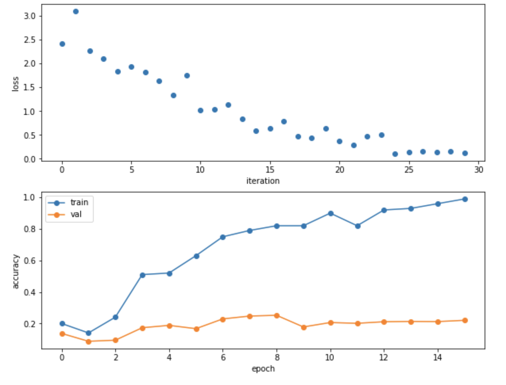

# 手写神经网络9：三层CNN

> 这个系列是我在完成斯坦福公开课CS231N的作业时候所做的一些记录，这门课程是公认的深度学习入门的神课，其作业也非常硬核，需要从底层实现各种神经网络模型，包括前馈神经网络、卷积神经网络和循环神经网络，LSTM等等。
>
> 作业不仅要求掌握numpy等python库的api用法，更要对神经网络的数学理论和公式推导有非常深的理解，实现起来难度比较大，因此我也将在这个系列的博客中记录自己推导和coding的过程
>
> 限于个人水平实在有限，我尽量减少参考网上代码的次数

## 1.三层CNN的架构

- 写了这么久我们终于来到了手写CNN的环节，当然我们前面写的一些东西比较naive，不堪大用，只能用于理解和学习CNN中各个层的作用，因此CS231N的assignment2为我们提供了一些写好的层，将原来的一些层进行了组合，比如`affine_relu_forward`，`conv_relu_forward`和`conv_bn_relu_forward`，其实也只是在我们写好的layers上面封装了一层函数，将全连接层+ReLU，卷积层+ReLU组合成了完整的一个层
- CNN通常来说是这样的架构：


- 而我们需要实现的三层CNN的架构就是：`conv - relu - 2x2 max pool - affine - relu - affine - softmax` 和上面的图基本一致。

## 2.代码实现

### 2.1初始化

- 我们定义了一个类`ThreeLayerConvNet`，并需要实现类的初始化和前向反向传播

- 初始化和前面的全连接神经网络基本一致，这里需要注意的就是，我们需要实现的三层神经网络架构中的参数主要有：
  - 卷积层的卷积核W1和偏差b1
  - 第一个全连接层的参数W2和b2
  - 第二个全连接层的参数W3和b3
- 以上这些参数都要按照正态分布的规则进行随机初始化，这一部分代码比较简单，就不放出来了。

### 2.2前向传播和反向传播

- 我们需要在loss函数中实现前向传播和反向传播，并求出所有参数的梯度和总的损失函数
- 前向传播的过程比较简单，就是用现成的api一层层计算下去：

```python
def loss(self, X, y=None):
        """
        Evaluate loss and gradient for the three-layer convolutional network.
        Input / output: Same API as TwoLayerNet in fc_net.py.
        """
        W1, b1 = self.params["W1"], self.params["b1"]
        W2, b2 = self.params["W2"], self.params["b2"]
        W3, b3 = self.params["W3"], self.params["b3"]

        # pass conv_param to the forward pass for the convolutional layer
        # Padding and stride chosen to preserve the input spatial size
        filter_size = W1.shape[2]
        conv_param = {"stride": 1, "pad": (filter_size - 1) // 2}

        # pass pool_param to the forward pass for the max-pooling layer
        pool_param = {"pool_height": 2, "pool_width": 2, "stride": 2}
        scores = None
        # 逐层实现反向传播
        out1, cache1 = conv_relu_pool_forward(X, W1, b1, conv_param, pool_param)
        out2, cache2 = affine_relu_forward(out1, W2, b2)
        scores, cache3 = affine_forward(out2, W3, b3)
        if y is None:
            return scores
```

- 然后反向传播就是用已经写好的单层反向传播组合起来，同时也可以算出loss函数，注意最后要加上正则项

```python
				 loss, grads = 0, {}
       
        loss, dout = softmax_loss(scores, y)
        dout3, grads['W3'], grads['b3'] = affine_backward(dout, cache3)
        dout2, grads['W2'], grads['b2'] = affine_relu_backward(dout3, cache2)
        dout1, grads['W1'], grads['b1'] = conv_relu_pool_backward(dout2, cache1)
        # 加上正则项
        loss += 0.5 * self.reg * (np.sum(W1 * W1) + np.sum(W2 * W2) + np.sum(W3 * W3))
        grads['W3'] += self.reg * W3
        grads['W2'] += self.reg * W2
        grads['W1'] += self.reg * W1
```

- 最后这个自己搭建的简单三层神经网络在CIFAR数据集上的表现如下图所示，可以看到在训练集上的表现非常不错，但是在测试集上的表现比较糟糕，原因也很简单，就是因为神经网络训练过程中过拟合了，如果考虑使用标准化层和DropOut可能表现效果会更好一点。



## 3.三层CNN的Pytorch实现

- 这部分作业的最后也要求我们用Pytorch实现一个架构和上面相同的CNN，而Pytorch框架有自动求梯度的功能，相比之下搭建神经网络就简单了很多。

```python
class ThreeLayerConvNet(nn.Module):
    def __init__(self, in_channel, channel_1, channel_2, num_classes):
        super().__init__()
        self.conv1 = nn.Conv2d(in_channel, channel_1, 5, padding=2, bias=True)
        nn.init.kaiming_normal_(self.conv1.weight)
        self.conv2 = nn.Conv2d(channel_1, channel_2, 3, padding=1, bias=True)
        nn.init.kaiming_normal_(self.conv2.weight)
        self.fc = nn.Linear(channel_2 * 32 * 32, num_classes)
        nn.init.kaiming_normal_(self.fc.weight)

    def forward(self, x):
        scores = Nonex = self.conv1(x)
        x = F.relu(x)
        x = self.conv2(x)
        x = F.relu(x)
        x = flatten(x) # 这是一个另外定义的将张量压缩成一维的函数
        scores = self.fc(x)
        return scores
```

- 我们用这样几行代码就做好了一个简单的三层神经网络，使用Pytorch的`nn.Module API`搭建神经网络的时候只需要继承`nn.Module`类，并在init函数中定义好所需要的层，在forward函数中定义神经网络的计算过程就可以了
- 模型的训练也很简单，只需要定义优化器和编写简单的每个epoch代码，Pytorch就会自动完成求梯度和反向传播的过程。