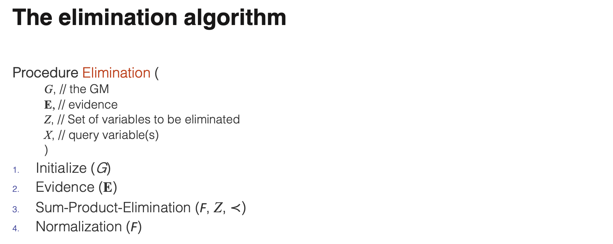
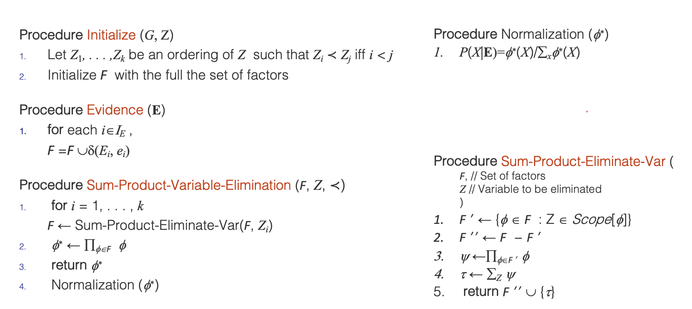
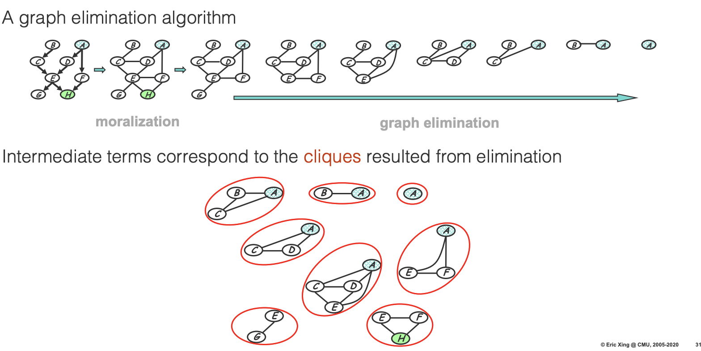
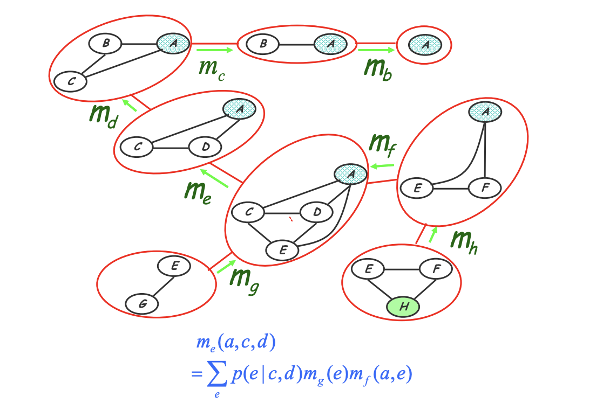
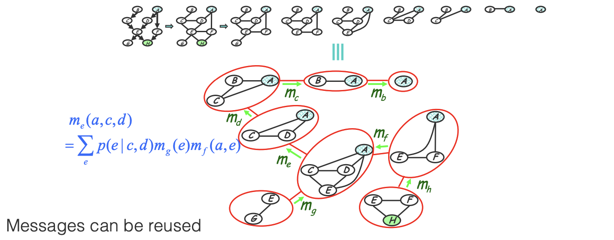

# CMU10-708PGM04：Exact Inference

> CMU10-708课程Lecture4《Exact Inference》的课程学习笔记，这一节开始介绍概率图模型中的推断，首先讲的是精确推断的方法

## 概率图模型中的任务

前面几节课主要讲了有向图模型和无向图模型等概率图模型的表示，实际上就是用图的数据结构来表示一系列随机变量的概率分布情况，二者都是**将复杂的联合分布分解为多个因子的乘积**，而区别在于有向图模型因子是概率分布、无需全局归一，无向图模型的因子是势能函数，需要进行归一处理，相比之下无向图模型的设计更加灵活，但随之而来的问题是计算的代价也就更高。

接下来的问题就是，我们表示出的概率图模型M(对应概率分布P)到底应该怎么用？事实上，我们可以用概率图模型进行**推断(Inference)**，这一节内容主要就在讲如何使用概率图模型进行精确推断。概率图模型中常见的问题有如下几种：

- 推断条件概率$$P_M(X|Y)$$，我们称这个过程为推断，我们称这样的任务为一个query
- 从数据集D中估计出合适的模型参数M，我们称这个过程为学习，但是在贝叶斯学派的理论中，我们要求的是概率分布$$P(M|D)$$，因此**也可以看成是一种推断**，更复杂的情况是数据包含隐变量，不能被完整的观测到

### 任务的分类

#### Query 1: Likelihood

最简单的一类任务是来推断一部分隐变量可能的分布情况，不是一般性我们可以假设要求的目标$$e=(X_{k+1},\dots,X_n)$$ 那么实际上就是需要计算：
$$
P(\mathbf{e})=\sum_{x_{1}} \cdots \sum_{x_{k}} P\left(x_{1}, \ldots, x_{k}, \mathbf{e}\right)
$$
这也可以叫做e的似然(likelihood)

#### Query 2: Conditional Probability

另一种常见的query是计算条件概率的分布，我们给定一些现有的条件e，并计算：
$$
P(X \mid \mathbf{e})=\frac{P(X, \mathbf{e})}{P(\mathbf{e})}=\frac{P(X, \mathbf{e})}{\sum P(X=x, \mathbf{e})}
$$
我们可以进一步将X分解成Y和Z两部分，并且：
$$
P(Y \mid e)=\sum_{z} P(Y, Z=z \mid \mathbf{e})
$$
这时候我们只需要计算Y，因此对Z所有的可能情况进行累加得到了Y的边际概率，这种操作叫做对Z变量进行边际化(Marginalization)，条件概率常见的用途有：

- 预测：给定起始条件预测结果的概率
- 诊断Diagnosis：给定最后的结果反推出可能的起始条件
- 在有偏观测的情况下学习模型参数

#### Query 3: Most Probable Assignment

最有可能的Assignment的求解实际上就是求最大化后验概率的过程，即：
$$
\operatorname{MPA}(Y \mid \mathbf{e})=\arg \max_{\mathrm{y}\in \mathcal Y} P(\mathbf{y} \mid \mathbf{e})=\arg \max_{\mathrm{y}\in \mathcal Y} \sum_{\mathbf{z}} P(\mathbf{y}, \mathbf{z} \mid \mathbf{e})
$$
MPA可以用于分类任务和模型的解释中，比如对于给定的条件找到最有可能的标签，就是求出后验概率的最大值的过程，同时后验概率也可以用于解释模型的结果

### 推断的复杂性和解决方式

推断的过程计算概率图模型中的$$P(X=x|e)$$是一个NP-hard的任务，这意味着我们找不到一个通用并且高效的，可以解决任意概率图模型问题的方式，但这并不意味着我们无法解决“推断”这个过程，我们可以采取的策略是对于某些类型的概率图模型任务采用特殊的方法进行求解。可以使用的解决方式包括：

- 精确推断方法：包括估计算法，消息传递算法，联合树算法(Junction tree)
- 近似推断方法：包括随机仿真，采样，蒙特卡洛方法和变分算法

而大部分的推断任务的计算过程都可以归结成sum-product的形式，也就是将一系列乘积相加，我们用Z表示概率图模型中的对象，用$$\phi$$表示需要考虑的因子，F是所有因子的集合，那么很多时候推断任务可以表示成
$$
\sum_{z}\prod_{\phi_\in \mathcal F}\phi(z)
$$

## 变量估计算法

变量估计实际上就是用query中给定的条件来估计整个概率图中的模型分布情况，可以用下面的形式来表示：
$$
P\left(X_{1}, \mathbf{e}\right)=\sum_{x_{n}} \cdots \sum_{x_{3}} \sum_{x_{2}} \prod_{i} P\left(x_{i} \mid p a_{i}\right)
$$
这里实际上就在说，我们通过剩下的所有随机变量来刻画$$X_1$$的概率分布，而现在我们知道了$$X_1$$的分布情况要反过来推测$$X_2-X_n$$的分布情况，这就是变量估计问题，对于这类问题我们采取的策略是迭代地进行变量估计。首先来回忆一下，计算$$X_1$$的操作过程如下：

- 首先将所有不相关的变量从内部移到外面
- 然后执行位于最内部的求和操作，得到一个新的项
- 将新的项加入表达式中进行相乘
- 最后进行wrap-up，即：

$$
P\left(X_{1} \mid \mathbf{e}\right)=\frac{\phi\left(X_{1}, \mathbf{e}\right)}{\sum_{x_{1}} \phi\left(X_{1}, \mathbf{e}\right)}
$$

而我们在进行变量估计的时候就正好要反过来操作，比如下面这个例子：

我们假设现在的任务是给定随机变量H的分布情况h，要来确定随机变量A的分布情况，那么进行参数估计的步骤可以归纳成如下几步：

- 将图中的所有随机变量的分布表示成条件概率的形式，比如：

$$
m_{h}(e, f)=p(h=\tilde{h}|e, f)=\sum_{h} p(h \mid e, f) \delta(h=\tilde{h})
$$

- 按照G，F，E，D，C，B，A的顺序进行估计，然后wrap-up

其实这一段我也没怎么看懂，PPT里面讲的过于抽象，放个图感受一下：

对于概率图的估计，可以从无向图模型G和估计顺序I开始进行如下循环：

- 每次对I中的下一个结点进行估计
- 将这个结点从图中移除，然后将剩下的邻居结点项链
- 对于重组以后的新图，保留在估计过程中新生成的边，然后相关的因素都在记录**估计团**的过程中被提取了出来

估计团是一个新概念，指的是在估计过程中概率图里产生的团，上面那个例子所产生的估计团如下图所示：

这些团也可以构造出一棵演化树的结构：

算法的复杂度由最大估计团的数量来决定(团和最大团等概念涉及到很多图论的知识)

## 消息传递算法

参数估计算法有一个问题就是只能处理一个query而不能处理大量的query，我们从另一个角度可以将估计看成是一种在团树上的“消息传递”，而这种所谓的“消息”可以被重复使用，也就可以处理多个query

- 这让我想起了图神经网络里的消息传递机制，不知道二者之间是否存在联系

这样一来我们可以将变量估计问题转化成树结构中的消息传递问题，在消息传递模型中，所有结点都会同时向自己的邻居结点传递自身产生的消息：

