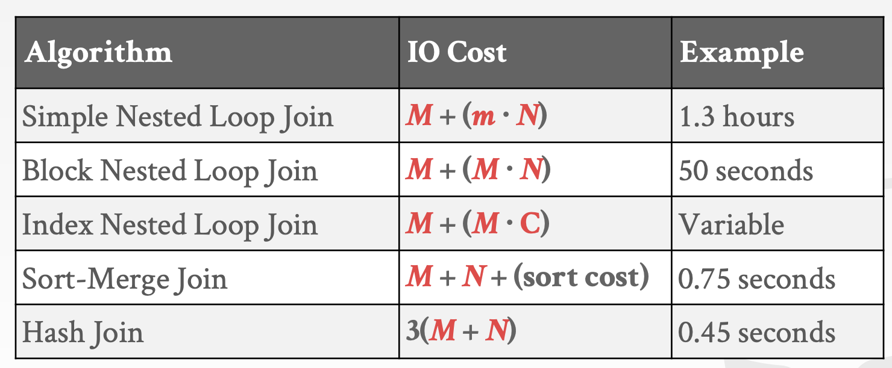

# CMU15-445-04：查询处理

> 这是CMU数据库课程15-445的第二个大的部分，主要讲数据库中的索引相关的内容，在2021秋的课程里应该对应Lecture09-Lecture12

数据库系统处理查询的时候经常需要进行的操作有排序，聚合和连接(Join)，下面先简单说一下每一种操作的不同实现方式。

## 常见的查询操作

### 排序

数据库系统往往需要对数据元组进行排序，而比如面临ORDER BY，GROUP BY等查询指令的时候，如果内存中能放得下所有的数据那自然就最好了，这样排序就可以直接在内存中进行，但是往往数据量一大起来之后这种美好的设想就无法实现了，而数据库系统中采取的解决方案是：采用**外部归并排序**(External Merge Sort)来完成对大量元组数据的排序。外部归并排序需要同时使用磁盘和内存，具体操作可以分成以下两个步骤：

- 排序：外部归并排序首先需要在小的chunk(块)中对内部的所有数据进行排序，要保证块的大小可以被内存接受，写完之后再写回磁盘中
- 归并：然后将磁盘中各个块内已经排序的块进行归并，得到总体的排序结果

同时，归并的方式最简单的是二路归并排序，这个应该在数据结构中学过，具体的就不讲了，也有更复杂的K路归并排序，二路归并需要三份buffer，而K路归并排序可以使用若干个buffer提高两个阶段的效率。

外部排序有两种常见的优化方式：

- 双倍缓冲区：即一个缓冲区用来执行归并排序的同时，另一个缓冲区用来加载磁盘中待操作的数据，这种方法可以减少I/O所需的等待时间
- 使用B+树来排序

### 聚合

聚合操作是在查询的过程中，将一些数据按照一定的规则聚合成一个结果并返回，常见的实现聚合操作的方法有两种：

- 排序：可以通过对要聚合的条件进行排序，然后筛选出需要聚合的元组完成聚合操作，内存够用就用内存，内存不够就上外部排序
- Hash：通过Hash操作将应该聚合在一起的元组映射到同一个结果中，然后进行聚合，但是如果表太大就可以进行划分，有两种策略：Partition和Rehash

### 连接Join

Join是SQL高级语法中非常重要的操作，一般数据表为了节约存储空间，会选择最小化表之间的信息重复，因此一个大表可能会被拆分成很多小的表进行存储，而join操作可以将跨表的信息进行连接，重新构建出大表中的详细信息。这门课程里讲的join主要就是inner equijoin，即针对**相同的key进行连接**

#### Join操作的定义

我们假设表R中的元组r和表S中的元组s的连接属性相等，那么连接操作就会将r和s组合成一个新的输出元组，事实上Join操作的实现方式有两种，

- 一种是直接合并数据，直接合并元组的数据得到新的元组并进行存储
- 一种是加入记录的id，不直接将属性值合并，而是在r后面加上s元组的id，等到需要用到s中特有的属性的时候再根据id去表S中查询，这种方式叫做materialization(实体化？)这么做可以减少存储空间，但是可能会导致查询效率的下降

Join操作有各种不同的实现方式，而评估Join操作的度量方式就是磁盘I/O次数，因为相比于I/O所需的时间，具体的计算和合并等操作消耗的时间数量级要小很多，因此我们下面分析不同算法的性能的时候主要考虑的就是磁盘I/O所需的次数。

我们不妨假设外部表R有M个页，一共有m个元组，内部表S一共有N个页和n个元组，下面我们来探究不同的Join算法的特点和性能

#### 嵌套循环Join

基于多层循环的Join操作顾名思义就是通过两个for循环来实现Join操作，对于每一个外部表R中的元组r，查询S的所有元组并找到可以join的元组，处理后存放到结果中，这样一来这种算法的复杂度就是
$$
M+(m\times N)
$$

- 两个for循环，首先需要读M个外部表的页需要M次I/O，然后对于其中的m个元组，每次都要读N个内部页
- 很明显我们希望能够选一个小的表作为外部页，这样可以减少I/O的次数

这是最简单的嵌套循环形式的Join，一个优化后的版本是使用基于块的嵌套循环Join，即对于每个外部表的每个块都遍历内部表的每个块来实现join，这样一来算法的复杂度被优化成了：
$$
M+M\times N
$$

如果数据库系统有B个buffer可以使用，那么有B-2个Buffer可以被用来扫描外部表，一个buffer用来扫描内部表，另一个buffer用来存放输出结果，这样一来复杂度就降低为了：
$$
M+[\frac{M}{B-2}]\times N
$$

如果数据库已经针对要查找的属性建立好了索引，那么就可以用索引加速join操作，这个时候一般外部表不使用索引而内部表使用索引。

#### 归并排序Join

另一种思路是可以对两个表按照要join的**属性进行归并排序**，这样一来属性值相同的元组就会被排在一起，然后就可以进行join了。

#### Hash Join

使用hash进行join的思路也是通过hash对不同的元组进行映射，将拥有相同join属性值(也就是key)的元组映射到同一个小的chunk中，这样就可以减少两个表之间的互相搜索的次数。基本的步骤包括建表和搜索两个部分，并且可以针对特定的情况做hash上的优化，比如说在已知外部表大小的情况下使用静态表，或者使用Bloom Filter

#### 总结

几种不同Join方法的总结如下：

