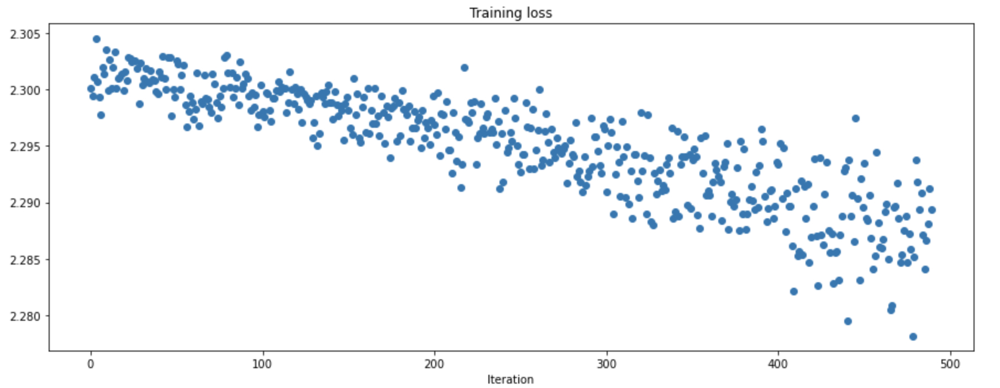

# 手写神经网络4：两层神经网络

> 这个系列是我在完成斯坦福公开课CS231N的作业时候所做的一些记录，这门课程是公认的深度学习入门的神课，其作业也非常硬核，需要从底层实现各种神经网络模型，包括前馈神经网络、卷积神经网络和循环神经网络，LSTM等等。
>
> 作业不仅要求掌握numpy等python库的api用法，更要对神经网络的数学理论和公式推导有非常深的理解，实现起来难度比较大，因此我也将在这个系列的博客中记录自己推导和coding的过程(尽量自己尝试写)

## 1.神经网络的初始化

- 两层的神经网络包含了输入层、隐层和输出层，其计算的过程包括`affine - relu - affine - softmax` 因此神经网络中的模型有四个参数W1，W2，b1，b2，因此神经网络的初始化中需要对这四个参数进行初始化，具体的实现代码如下：

```python
class TwoLayerNet:
    def __init__(
        self,
        input_dim=3 * 32 * 32,
        hidden_dim=100,
        num_classes=10,
        weight_scale=1e-3,
        reg=0.0,
    ):
        """
        Initialize a new network.
        Inputs:
        - input_dim: An integer giving the size of the input
        - hidden_dim: An integer giving the size of the hidden layer
        - num_classes: An integer giving the number of classes to classify
        - weight_scale: Scalar giving the standard deviation for random
          initialization of the weights.
        - reg: Scalar giving L2 regularization strength.
        """
        self.params = {}
        self.reg = reg

        self.params['b1'] = np.zeros(hidden_dim)
        self.params['b2'] = np.zeros(num_classes)
        # 用正态分布对全连接层的权重矩阵W1与W2进行随机初始化，并且均值为0，方差为weight_scale
        self.params['W1'] = np.random.normal(loc=0, scale=weight_scale, size=(input_dim, hidden_dim))
        self.params['W2'] = np.random.normal(loc=0, scale=weight_scale, size=(hidden_dim, num_classes))
```

## 2.损失函数与梯度的计算

- 在二层神经网络初始化完成之后就可以进行计算，我们这里实现的类`TwoLayerNet` 并不进行梯度下降的优化，而是在另一个Solver类中完成。
- 这里的损失函数和梯度函数的计算有两种情况，一种是训练的时候参数中包含了标签，这时候就需要计算梯度和loss，而预测的时候则不需要计算梯度，直接求解预测结果就可以

```python
def loss(self, X, y=None):
        scores = None
				 # 先进行一个前向传播，下面三行代码分别对应了第一层全连接层，ReLU层和第二层连接层
        out0, cache0 = affine_forward(X, self.params["W1"], self.params["b1"])
        out1, cache1 = relu_forward(out0)
        scores, cache2 = affine_forward(out1, self.params["W2"], self.params["b2"])
        # 在输入测试集的时候直接返回scores就可以
        if y is None:
            return scores

        loss, grads = 0, {}
				 # 计算loss函数并加上正则项
        loss, dout = softmax_loss(out, y)
        loss += 0.5 * self.reg * (np.sum(self.params['W1'] ** 2) + np.sum(self.params['W2'] ** 2))
        # 使用loss函数进行反向传播的梯度计算
        dout, dw, db = affine_backward(dout, cache2)
        grads['W2'], grads['b2'] = dw + self.reg * self.params['W2'], db
        dout, dw, db = affine_relu_backward(dout, cache1)
        grads['W1'], grads['b1'] = dw + self.reg * self.params['W1'], db
        return loss, grads
```

## 3.solver和优化器

- solver类是CS231N的**作业直接给出**的，用于更新两层神经网络模型的参数，并使用随机梯度下降算法作为优化算法，其使用方式如下：

```python
data = {
      'X_train': # training data
      'y_train': # training labels
      'X_val': # validation data
      'y_val': # validation labels
}
model = MyAwesomeModel(hidden_size=100, reg=10)
solver = Solver(model, data,
                update_rule='sgd',
                optim_config={
                  'learning_rate': 1e-3,
                },
                lr_decay=0.95,
                num_epochs=10, batch_size=100,
                print_every=100)
solver.train()
```

- train函数的具体代码实现我们就不去关注了，要读懂还是挺麻烦的，这里使用的优化器SGD其实就是随机梯度下降的一种实现，随机梯度下降是每次选择一个小batch size的数据对其求梯度并更新到参数矩阵中去，实现SGD的代码如下：

```python
def sgd(w, dw, config=None):
    """
    Performs vanilla stochastic gradient descent.
    config format:
    - learning_rate: Scalar learning rate.
    """
    if config is None:
        config = {}
    config.setdefault("learning_rate", 1e-2)
    w = w - dw * config["learning_rate"]
    return w, config
```

- 后面我们还会实现**动量法，Adam算法等优化算法**，这里暂且不表，最后在测试中loss的变化趋势如下：



