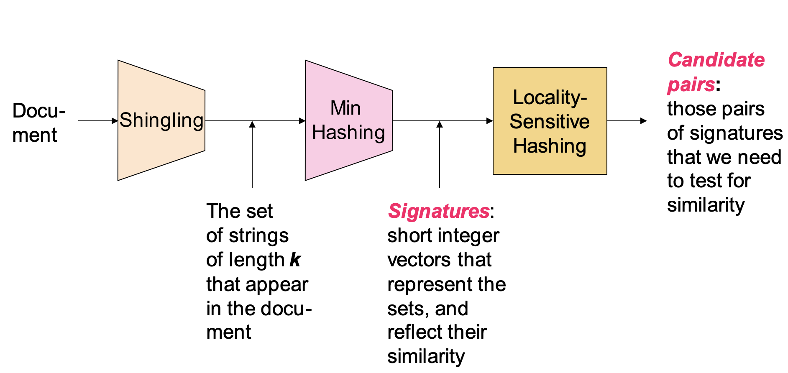

# 局部敏感哈希

## 局部敏感性哈希算法

### 问题背景

​	  我们时常会碰到一些比较大量样本相似性，并选择出和输入的内容最相似的样本，淘宝提供的拍照识别商品功能，可以找到和拍摄照片最相似的商品推荐给用户，事实上这一类问题都可以归结为找到最相似的集合这一目标上，也就是在高维空间中找到相近的邻居，常见的例子有：

- 文本查重，找文档之间的相似度
- 图像的识别
- 推荐系统和搜索引擎

一般来说，在给定一些高维数据点$x_i$和距离度量函数$d(x_i,x_j)$的情况下找到和输入q比较接近的数据点满足$d(q,x_i)\le S$(即邻居)的时间复杂度是线性的，而找到这些样本中所有满足$d(x_i,x_j)\le S$的点对的时间复杂度是平方级别的，一旦数据量大起来，算法就会消耗大量时间，而这门课的重点内容就是“挖掘海量数据集”(课程名)，因此我们需要想办法将“找相似样本”的时间复杂度降低。

### 算法的描述

​	  局部敏感性哈希就是用来解决上面这个问题的，事实上这是一大类算法，这类算法的基本思想是将一系列item映射到一个个bucket中去，然后将需要判别的数据也进行映射，同一个bucket里的样本存在比较高的相似性，但是这样的方法也会产生false negative的情况，也就是说本来相似的item可能不会被分到一个bucket中。

我们也很容易发现局部敏感性哈希的关键就在于怎么定义一个有良好区分度的hash函数。

### 实例：相似文档检索

​	  面对海量的文档数据的时候，找到相似的文档是一件时间复杂度非常高的事情，这时候就可以用局部敏感性哈希，具体可以分成如下三个步骤：

- Shingling：将文档转化成一个向量表示，比如用某个单词是否出现为标准形成一个K维的布尔向量
- Min-Hashing：将文档的表示转化成一些简短的signatures，并且保留相似度相关的信息(实际上是一种降维)
- 局部敏感性哈希：使用得到的简短signatures进行局部敏感性哈希操作

