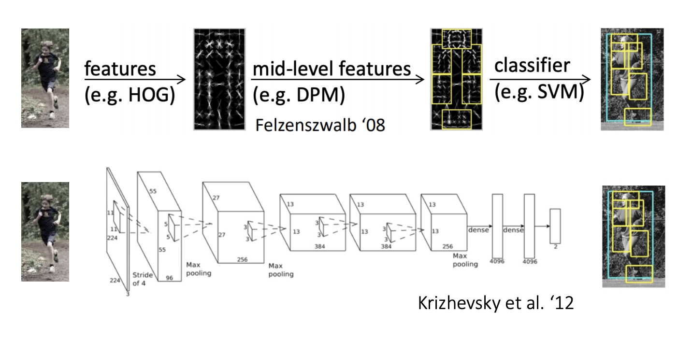
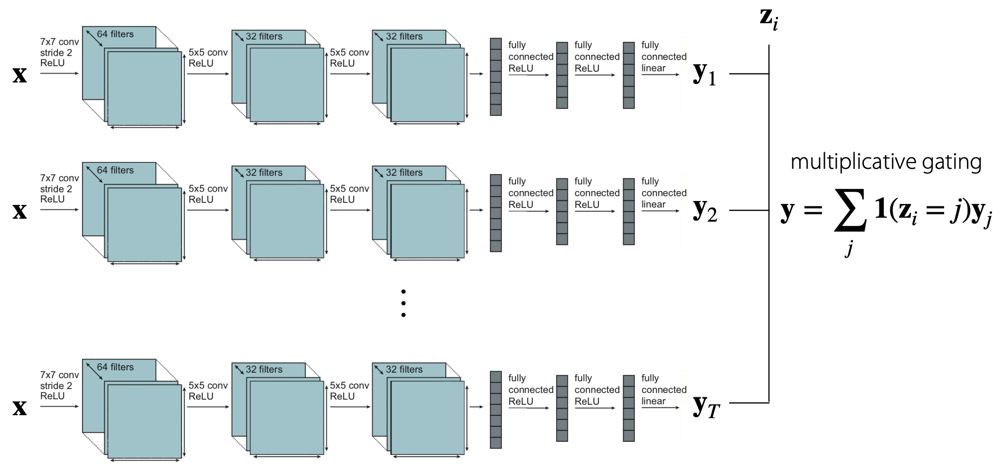
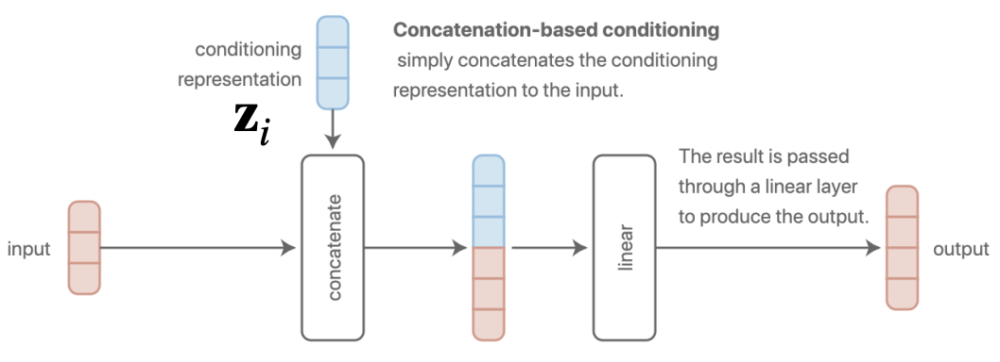
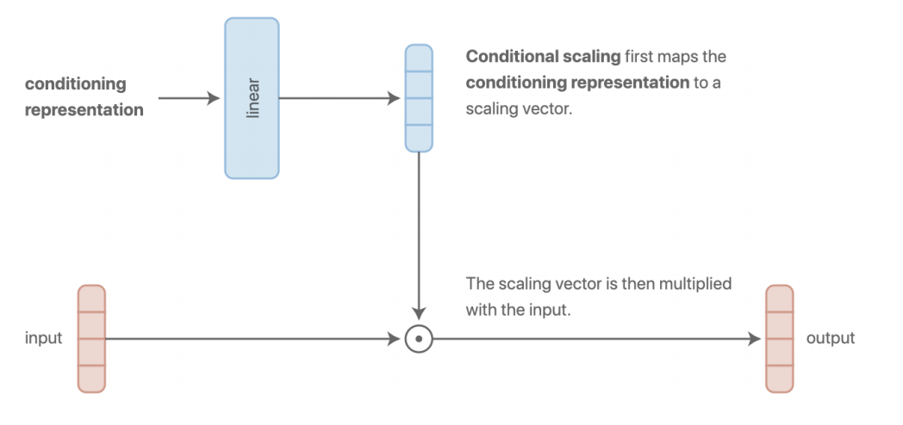
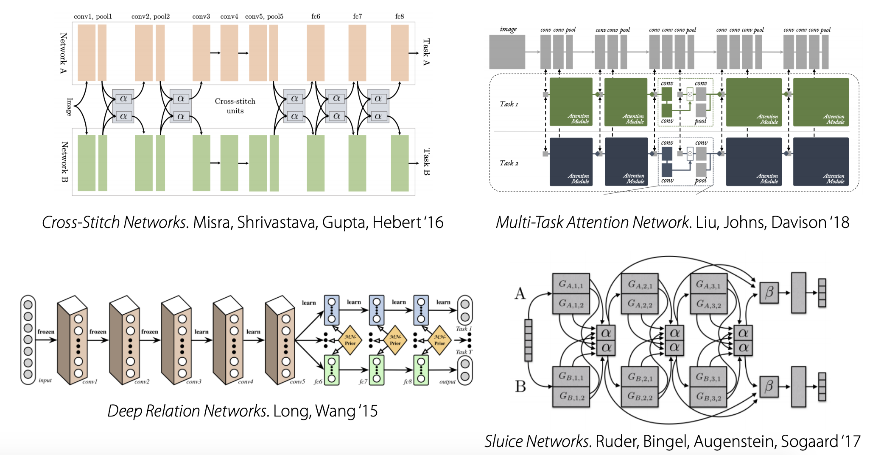
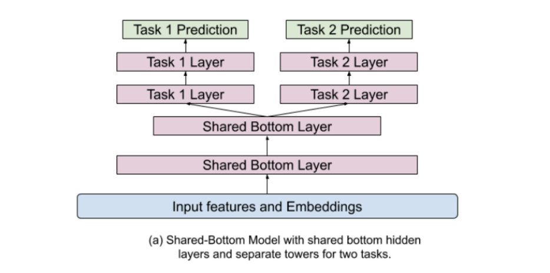
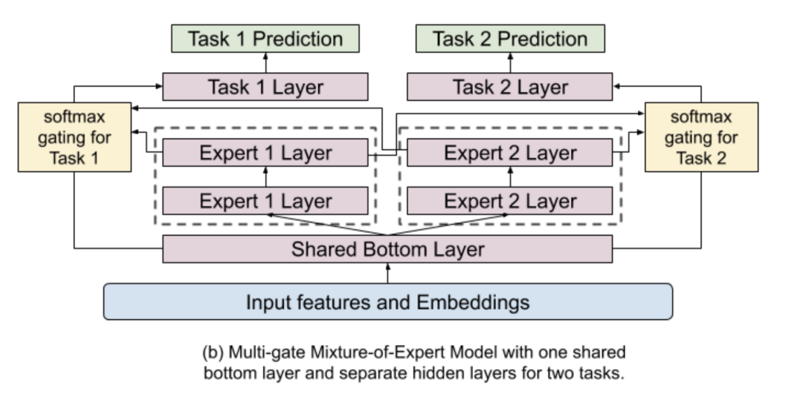

# CS330：Multi-task Learning&Meta Learning1

## Course Introduction

### 课程内容

- 课程实验使用Colab和TensorFlow实现
- 该课程的主题包括：
  - 多任务学习和迁移学习基础
  - 元学习算法
  - 元学习的前沿话题
  - 层级化的贝叶斯模型和元学习
  - 多任务强化学习和目标条件强化学习
  - 元强化学习
  - 层级化强化学习
  - 终生学习

### 为什么需要研究多任务学习和元学习

​	  和传统方法相比，深度学习方法允许我们处理非结构化的输入，并且不需要手动提取特征，需要的领域知识相对而言更少。

​	  深度学习发展到今天已经逐渐变成了使用超大规模的数据来训练一个超大规模的模型，但如果我们没有大量的数据，我们应该如何训练模型呢？比如医学图像，机器人和个性化教育等领域，我们在训练模型的时候可能会发现没有这么多的数据供我们使用。如果我们需要在短时间内快速学习一些新的东西又该怎么办？这些问题都可以使用多任务学习和元学习的方式来解决。

#### 什么是多任务

​	  任务(task)就是在一个数据集D上定义损失函数L并建立模型f，不同的任务可以在各种条件和目标上有所不同，我们的一个关键假设是：我们可以从不同的任务中提取到相同的结构，如果这个假设不成立，那么最好还是回到单任务学习中去，但好消息是，很多不同的任务都有类似的结构可以共享，这些可以共享的信息包括：

- 真实数据中的一些物理规则
- 人类总是有所意图，按照一定的想法行事
- 语法规则(比如英语文本的数据都遵循英语的语法)
- 不同的语言是为了相同的目的而设计的(这里应该说的是人类语言而非编程语言)

#### 多任务学习问题和元学习问题

​	  多任务学习问题是指从所有的任务中进行学习得到的效果比每个任务独立的学习要好，而元学习是指，对于给定的数据集，需要学习出解决新问题的能力和模式

## 多任务学习和迁移学习

### 多任务学习

#### 基本的定义和符号

​	  课程中首先给出了一些概念的形式化定义，包括单任务的学习，损失函数，多任务学习等等，其中单个任务的学习可以抽象成在数据集$D=\{(x,y)_k\}$上最小化损失函数$L(\theta, D)$，而损失函数往往可以使用负的对数似然，即：
$$
L(\theta, D)=-\mathbb{E}_{(x,y)\sim D}[\log f(y|x)]
$$
而多任务学习就是要给定了若干个任务，每个任务都有其数据分布和损失函数，可以表示为：
$$
T_i\triangleq	\{p_i(x), p_i(y|x),L_i\}
$$
在多任务分类中，各个任务之间的损失函数是相同的，而在多标签的学习中，数据集的分布$p_i(x)$的分布是相同的。而多任务学习的**一种目标**可以是训练出让所有任务的损失函数之和最小的模型，也就是：
$$
\min_{\theta}\sum_{i=1}^TL_i(\theta, D_i)
$$
我们可以将不同任务的模型统一成一个模型，即$f_{\theta}(y|x,z_i)$，这里的$z_i$是一个任务的标注，用来表示不同的任务。

#### 多任务学习模型

​	  我们不妨假设$z_i$是一个one-hot的任务索引，为了尽可能减少任务训练时共享的内容(如果共享了就容易变成单任务学习任务)，我们可以给每个任务单独使用一个神经网络进行训练，这样一来各个任务之间学习到的参数就不会共享了。

而另一个极端是直接将任务的标识$z_i$融入到神经网络的层中，这样一来所有的参数都会进行共享。

我们可以将模型的参数按照任务分割成若干个$\theta^i$，并且不同的模型的参数之间可能会进行共享，我们用$\theta^{sh}$，这样一来我们的训练目标就可以表示成：
$$
\min _{\theta^{sh}, \theta^{1}, \ldots, \theta^{T}} \sum_{i=1}^{T} L_{i}(\left\{\theta^{s h}, \theta^{i}\right\}, D_{i})
$$
因此如何决定不同任务$z_i$的condition，实际上就等价于我们如何选择各个任务对应的模型之间的参数。常见的方法有如下几种。

- Concatenation-based conditioning，将任务的表示信息添加到输入数据中

- Additive conditioning，将任务的信息变成一个向量和输入的数据相加，这两种方法本质上是相同的

- 基于多头机制的模型架构，可以给不同的任务设置特定的层

- Multiplicative conditioning，和Additional Condition类似，只不过改成了用向量乘积对输入数据和condition表示进行运算，这种方法可以生成独立的network和独立的头，并且增强每个layer的表达能力。

- 更复杂的选择，需要阅读更多的原论文，这里就放个图片看个乐子

​	  然而这些设计就跟神经网络调参数一样，对于每个问题是独立的，也就是说一个问题需要一个特定的解决方案，并且需要很多和问题所在专业领域相关的直觉和知识，目前来看更像是一种行为艺术而不是科学。换句话说，这种多任务学习的设计泛化性很差。

#### 如何定义学习目标

​	  前面已经提到了一种多任务学习的目标函数，即$\min_{\theta}\sum_{i=1}^TL_i(\theta, D_i)$，在此基础之上我们可以给每个任务加上一个权重，将目标函数变成：
$$
\min_{\theta}\sum_{i=1}^Tw_i L_i(\theta, D_i)
$$
那么如何选择权重参数$w_i$呢？这需要在训练模型的时候进行动态的调整，很大程度上取决于这个任务的重要性或者优先级目前已经被提出的方法有：

- 启发式的方法
- 使用任务的不确定性，Use task uncertainty
- 单调改进帕托累最优解
- 优化表现最差的任务的loss

#### 如何优化

​	  我们先使用最简单的vanilla多任务目标函数$\min_{\theta}\sum_{i=1}^TL_i(\theta, D_i)$，一个基本的优化方法是采用mini-batch梯度下降法(事实上进行了面向多任务的改造)，需要以下几个步骤：

- 选择一个小批量的任务集合
- 对于选择的每个任务，选择一个小批量的数据点
- 计算这些任务在这些数据上的损失，并进行梯度的反向传播
- 利用反向传播来优化参数(比如可以使用Adam)

#### 存在的挑战

- Negative Transfer问题：有的时候独立的神经网络的表现更好，这是因为不同的任务之间可能会在训练的时候互相干扰，不同的任务的模型的学习程度也各不相同，同时模型也存在着表示能力的上线。实际上Negative Transfer本质的问题在于参数共享的太多了，反而影响性能，我们可以使用软参数共享的方式来缓解这个问题：

$$
\min _{\theta^{s h}, \theta^{1}, \ldots, \theta^{T}} \sum_{i=1}^{T} \mathscr{L}_{i}\left(\left\{\theta^{s h}, \theta^{i}\right\}, \mathscr{D}_{i}\right)+\sum_{t^{\prime}=1}^{T}\left\|\theta^{t}-\theta^{t^{\prime}}\right\|
$$

- Overfitting问题：模型对一些任务的训练产生了过拟合，本质上是因为不同任务之间共享的不够多，解决方法是可以加一个正则项

#### 实例：Youtube视频推荐

​	  youtube视频推荐系统就是一个经典的多任务学习系统，需要输入的数据是用户正在看的视频和用户本身的特征，我们需要生成若干个预选视频，并且将它们进行排序，然后将其推送给用户。事实上，这个排序的过程输出结果包含了候选视频的参与度(Engagement)和用户的满意度(Satisfaction)，需要综合考虑这两项内容来对候选的视频进行排序，这里的Engagement和Satisfaction实际上可以作为二分类问题，也可以作为一个回归问题。

​	  一种基本的想法是Share-Bottom Model，这实际上就是一个multi-head的架构，如下图所示：

当然上面的只是一个baseline，而相关论文中给出的架构是一种Multi-gate Mixture-of-Experts(MMoE)模型，采用了软参数共享的模式，具体的就不多讲了。

### 迁移学习

​	  迁移学习(Transfer Learning)是通过解决一个源任务$T_a$之后将其中学习到的知识迁移到任务$T_b$上并完成该任务的学习。迁移学习是多任务学习的一种解决方案，但是反之不亦然。

​	  我们可以通过微调(fine-tuning)的方式来进行迁移学习，我们假设已经训练好的模型的参数是$\theta$，那么迁移后的模型的参数可以使用下面的方法来生成：
$$
\phi\leftarrow \theta -\alpha \nabla_{\theta}L(\theta, D^{tr})
$$
说白了就是先用一个任务的一批数据训练一个模型出来，然后用另一个任务的另一批数据对模型进行再训练，调整一下参数，然后看看在新任务上表现行不行，一些常见的迁移学习微调方法包括：

- 通过一个比较小的学习率进行调整
- 越前面的层学习率越小，越往后越大
- 锁定前面的层而着重于调整后面的层
- 重置最后一层
- 通过交叉验证的方式进行超参数搜索

事实上在CV和NLP领域有很多预训练模型可以从开源网站上获取。

