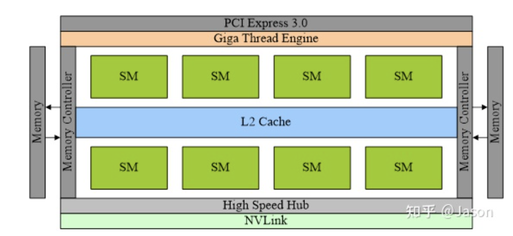
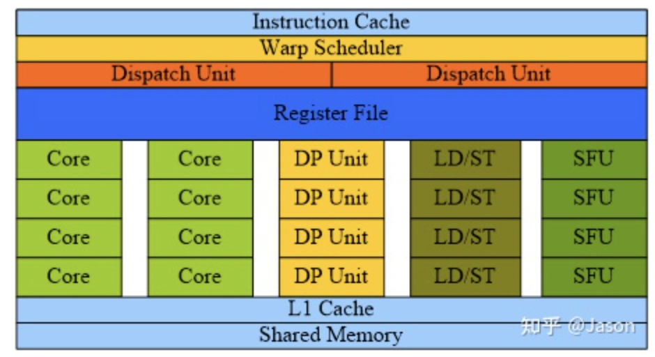
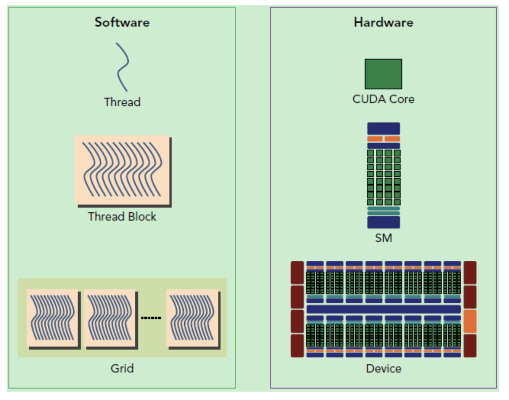
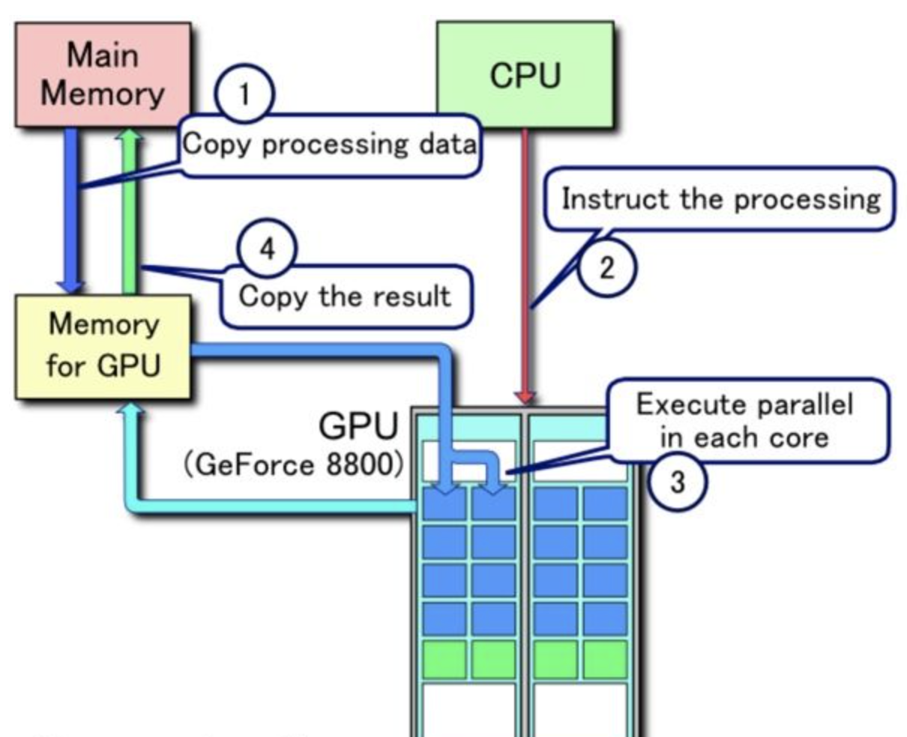

# GPU的体系架构

> 在阿里云基础平台开发实习期间学习的一些笔记，当然处于保密性原则，这些笔记只包含网络中可以搜索的公开内容，不包含任何涉密信息。

​	  GPU是图形处理单元(Graph Processing Unit)，一开始是为了绘制图形和渲染设计的，但是逐渐增加了很多新的功能，GPU是显卡最核心的组成部分，但是显卡还包括了很多其他的组成部分，比如散热器，通讯组件和各种接口。

## GPU和CPU的异构计算

​	  GPU需要和CPU进行协同工作，不能作为一个单独的计算平台来使用，可以看成是CPU的协处理器，因此所谓的GPU并行计算实际上是指CPU+GPU的异构计算架构，这种架构中CPU和GPU通过PCle总线进行连接并且CPU是host，而GPU是device，相比于CPU，GPU更加适合计算密集的任务，比如大型的矩阵运算，而CPU的运算核心比较少，但是可以实现复杂的逻辑运算，因此CPU适合做控制密集型的任务。

​	  同时CPU上的线程是重量级的线程，上下文切换的过程开销比较大，而GPU中的线程是轻量级的线程，因此可以用CPU负责处理逻辑复杂的串行程序，而用GPU处理数据密集型的并行计算程序，互相取长补短。

## GPU的体系架构

### 总体架构

​	  一个典型的GPU由如下这些组件组成整体架构：

- PCI Express 3.0：GPU与CPU的连接总线，负责传输指令和数据
- Giga Thread Engine：负责将线程块Block分配给SM
- SM： Streaming Multiprocessors，**流多处理器**，负责执行Block
- L2 Cache：二级缓存
- Memory Controller：内存控制器，负责访问显存
- Memory 显存(内存)
- High Speed Hub：HSHUB，高速集线器，负责GPU间的内存访问
- NVLink：GPU间的高速互联接口

### 流多处理器架构

​	  每个流多处理器(SM)其实都像一个小型的计算机，并且组合成了一个计算集群，首先由CPU通过PCIE总线将任务传递给Giga线程引擎，然后引擎将任务进行分解并传递到每个SM上面，而SM的组成部分如下图所示：

- Instruction Cache：指令缓存
- Warp Scheduler：线程束调度器，包含了数十个Core，每个Core都可以执行一个线程
- Dispatch Unit：指令分发器，根据Warp Scheduler的调度向核心发送指令
- Register File：寄存器
- Core：计算核心，负责浮点数和整数的计算
- DP Unit：双精度浮点数计算单元
- SFU：Special Function Units，特殊函数计算单元
- LD/ST：访存单元
- L1：一级缓存
- Shared Memcoy：共享内存

每个流多处理器接到任务之后，会由Warp Scheduler对其进行进一步的分解，并由Core来执行细分之后的任务。

### GPU计算的层级化结构

​	  因此GPU的计算结构实际上分成了三层，即Device--SM--Core，整个GPU就是一个设备，包含了众多的SM，而每个SM里面又有多个core，这也和CUDA的任务分配相对应，CUDA将任务分成三个层级，分别是Grid--Block和Thread，每个GPU执行一个对应的Grid，而每个SM执行一个block(也叫做线程块)，每个core负责执行一个对应的thread

​	  而各个SM之间只能通过全局内存间接通信，没有其它互联通道，所以GPU只适合进行纯并行化计算。如果在计算过程中每个SM之间还需要通信，则整体运行效率很低。

## 关于GPU的核心问题

### 如何与CPU协同工作

​	  CPU和GPU通过内存映射IO(Memory-Mapped IO)进行的，CPU通过MMIO访问GPU的寄存器状态，任何的命令的批示CPU发出，然后被提交到GPU

### GPU的存储架构

​	  GPU中的存储结构最多可以分为五层，分别是寄存器，L1缓存(SM中)，L2缓存(GPU上面)，GPU显存，系统的显存，其存取速度依次变慢。

### SIMD和SIMT

​	  SIMD是单指令多数据，SIMT是单指令多线程，是SIMD的升级版，可以对GPU中的单个SM的多个Core同时处理同一个指令，并且每个Core存取的数据可以是不同的，这是的SIMD的运算单元可以被充分利用。

### CUDA编程模型

​	  在CUDA中，**host**和**device**是两个重要的概念，我们用host指代CPU及其内存，而用device指代GPU及其内存。CUDA程序中既包含host程序，又包含device程序，它们分别在CPU和GPU上运行。同时，host与device之间可以进行通信，这样它们之间可以进行数据拷贝。典型的CUDA程序的执行流程如下：

- 分配host内存，并进行数据初始化
- 分配device内存，并从host将数据拷贝到device上
- 调用CUDA的核函数在device上完成指定的运算
- 将device上的运算结果拷贝到host上
- 释放device和host上分配的内存