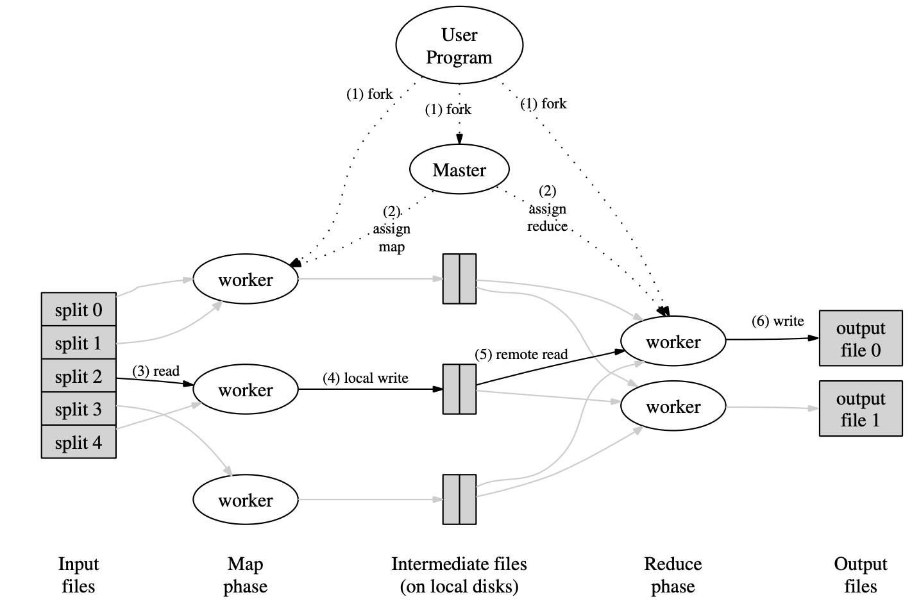

# Lecture1：Introduction&MapReduce

> 这一节的内容包含了MIT6.824分布式系统课程的Lecture1的内容(课程介绍，MapReduce)以及阅读MapReduce原论文过程中做的一些笔记。

## Introduction

### 为什么需要分布式系统

​	  分布式系统是使用多台计算机进行合作的计算机系统，可以应对逐渐增加的并发量，通过复制进行一定的容错，通过隔离来实现安全性，但是分布式系统也存在很多问题，比如：

- 有非常多的并发模块，互相之间的 交互非常复杂
- 必须应对各种可能出现的failure
- 很难实现性能上的潜力(tricky to realize performance potential)

### 课程内容介绍

- 介绍了课程的组成：Lecture+Papers+Exams+Labs
- 课程要讲的主题包括分布式存储，通信交流和计算，详细分成了如下几个topic
  - 容错Fault Tolerance，通过备份和部署多台服务器的形式实现(replicated servers)
  - 一致性Consistency，需要对系统中的各种读写行为进行良好的定义
  - 性能Performance
  - 容错，一致性和性能之间的妥协，强大的容错机制和一致性需要用良好的communication，但是为了提高速度只能牺牲一致性

### 分布式系统的发展历史

- 局部的网络和互联网应用
- 数据中心，用于存储大量的数据，支持大量的用户使用，很多大公司比如Google，Yahoo等都在使用，并在此基础之上发展出了搜索引擎和大规模的电商系统
- 云计算，用户使用外部的计算资源，通过互联网访问并进行计算
- 目前分布式系统仍然是工业界和学术界研究的重点

## MapReduce架构

- 本节内容结合原论文《MapReduce: Simplified Data Processing on Large Clusters》以及6.824的lecture notes整理而成
- 事实上Lectue notes里面将所有的Master都改成了Coordinator，不知道这算不算是政治正确带来的影响，然而我没有这些所谓政治正确，因此还是继续使用Master指代MapReduce中的调度程序

### 简介

​	  MapReduce是一种通用的编程框架，可以用于处理和生成大规模数据集，它主要分成两个部分，一个是Map函数一个是Reduce函数，通过 Map 函数对一个基于 k-v 对的数据集进行处理，生成对应的中间数据集，再通过 Reduce 函数对这些中间数据集中具有相同的 key 的 value 进行合并。同时MapReduce向用户隐藏了所有具体的分布式的细节，用户只需要编写好Map和Reduce两个函数就可以在一个MapReduce架构的系统中运行。

### 简单的例子

​	  原论文中举了一些很经典的例子来说明MapReduce编程模型的使用方式，主要有：

- 分布式grep(一个Linux指令)：map函数中统计匹配对应模式的句子，Reduce函数将结果进行汇总并输出
- 计算网址访问频率：map函数统计log中的网址并输出<URL,1>并由Reduce函数进行统计
- 倒排索引：map函数分析每个文档并统计出 <word, document ID>的key-value对作为输出结果，reduce函数按照word对所有的document ID进行归纳统计
- word count：文本单词计数，其为伪代码如下，其中Map阶段的k和v分别表示文本的id和对应的文本，reduce阶段的k和v分别表示单词和其出现的频率

```python
def Map(k, v):
  split v into words
  for word in words:
    emit(word, 1)

def Reduce(k, v):
  emit(len(v))
```


### 总体架构与工作流程




​	  在一个MapReduce系统中，用户将所有的作业提交到一个调度系统上，每个作业包含了一系列任务，然后调度系统将其分配到一个计算机集群中的若干台计算机上进行运行，整个过程大致可以分为如下几步：

- 首先将输入文件分成M个切片，并在计算机集群上重复这一操作，同时用户程序会产生一系列程序
- 其中有一个程序是特殊的，被称为Master，其余的程序被称为Worker并且可以被Master进行调度，假设有M个Map任务和R个Reduce任务，Master会给闲置的Worker安排一个Map任务或者Reduce任务
- 被布置了Map任务的Worker会读取正确的文件切片，解析key-value对并调度编写好的Map函数，将生成的中间结果保存在内存的缓冲区中
- 内存中存储的Map运算的中间结果(也是key-value的形式)被阶段性地写到本地磁盘中，并且被分成R个Region，然后将本地磁盘存储位置等信息发送给Master，由Master负责将这些位置信息传递给Reducer
- 当一个Reducer被Master告知Map结果的存储信息之后，它就回通过远程过程调用(RPC)读取数据，读取完成之后根据key进行排序，然后将key相同的value进行合并，同时如果内存不够需要使用外部排序
- Reducer遍历处理后的key-value对，并将其传递到用户程序的reduce函数中，由用户程序产生最终的结果
- 当所有的Map和Reduce执行完毕的时候Master会唤醒用户程序继续执行用户程序调用MapReduce之后的代码

### 核心功能的设计

#### Master数据结构

​	  Master中管理了一系列数据结构，对于每个map任务和reduce任务会保存其状态(idle, in-progress, or completed)，对于每台工作计算机保留其标识符。

​	  此外Master还有将中间文件从map传递给reduce，因此对于每个完成的map任务，Master都会存储这个任务产生的R个中间文件的位置和大小等元数据，并将其发送给处于in-progress的reduce工作机

#### 容错机制

##### Worker故障

​	  Master会定期ping一下工作机，如果规定时间内没有收到回复就会认为工作机已经崩溃了，这时候所有由这台机器进行的map任务会被reset并且换一台机器重新开始。

​	  在出现工作机崩溃的时候，完成的map任务需要重新执行一遍，但是完成的reduce任务就不需要重新执行一遍，因为map任务产生的结果存储在局部文件中，而reduce的结果存储在全局文件系统中。

​	  当一个任务被A先执行然后被B重新执行的时候(A发生了崩溃)，所有执行Reduce操作的工作机都会被通知这一任务被“再执行”了，任何没有从A的结果中读取数据的reduce工作机将会从B中读取数据。

##### Master故障恢复

​	  Master的故障恢复可以通过记录checkpoint的方法来解决，如果一个Master故障了，就可以从checkpoint开始重新执行。而论文中给出的MapReduce实现了当Master故障时直接abort整个作业的机制，此时如果有需要，客户端可以再次尝试并重新运行整个MapReduce作业。

#### 局部性

​	  网络带宽在这样一个平台中时相对稀缺的资源，MapReduce系统充分利用了工作机的本地磁盘来存储输入文件，并在Master中维护相关的信息，同时使用谷歌文件系统GFS来帮助进行文件管理，GFS会把文件划分成若干个64MB的块，并存储若干个备份，使用本地存储可以大大降低所需要的网络带宽。

#### 任务的粒度(Granularity)

​	  前面提到map阶段和reduce阶段的工作要分别分成M份和R份，但实际上M和R的值要远大于真正在运行的工作机的数量，这样可以**达到动态加载的平衡**，同时也加快故障恢复的效率，节约网络所需的带宽，同时MR也是有一个上界的，这受制于Master的性能：因为Master只能处理$O(M+R)$个调度，并且需要$O(MR)$的空间。

### 设计细节

​	  主要介绍一些MapReduce中的设计细节，对应原论文的Section 4

#### 分区函数与顺序保证

​	  输入数据的分区(即将输入数据分配到一个特定的工作机上)在具体分区的时候需要通过一个分区函数来实现，一般默认的方法是使用hash函数完成输入数据的分区，即hash(key) mod R的形式，同时如果key是URL等特殊形式的时候，还可以进行一些特殊的操作来完成分区，比如使用hostname代替。

​      同时要保证每个分区中数据的顺序，一般来说key是按递增顺序存储的，这样可以更好地保证生成一个排好序的结果文件。

#### 组合函数

​	  很多时候Map生成的结果会有很多重复的内容需要进行合并，这时候就需要一个Combiner Function，这个函数在每个执行Map的工作机上运行，并且这个 Combiner Function和Reduce函数的形式是非常相似的，相当于在每个Map过程中就进行了一次Reduce，二者最大的区别在于如何处理它们的输出结果，Reduce函数将处理结果直接作为输出了，而 Combiner之后的结果还要先写在一些临时的中间文件中进一步处理。

#### 输入输出的类型

​	  MapReduce支持多种不同的输入输出方式，在输入的时候，如果是文本模式，就会将文本的每一行作为一个key-value对，其中key是偏移量而value是一行文本，另一种方式是直接按key-value的形式将数据存在文本文件中，直接按顺序读取即可，同时用户可以定义一定的规则来正确地读取输入文件，可以通过实现一个reader接口来自定义合适的输入读取方式，而输出方式也支持多种类型。

#### 跳过坏记录

​	  很多时候用户程序里会有bug，但有的时候这样的bug很难被修复，比如说这个bug来自第三方库的时候，因此只能选择跳过一些记录，MapReduce中提供了一个可选择模式，在执行的时候可以发现是哪条记录引起了故障，并且跳过这些记录直接往后继续下去。

​	  每台工作进程会有一个信号量处理程序来处理接受到的段违规和总线错误(segmentation violations and bus errors)等信息，在开始一个Map或者Reduce操作之前，MapReduce会将参数的序列号存储在全局变量中，如果用户代码产生了一个信号量，那么信号量处理程序会把一个“last gasp”的UDP包发送给Master，当Master发现在一个记录上failure超过一个的时候，这一部分记录就会被忽略

#### 本地执行

​	  MapReduce是一个分布式系统，因此执行过程中debug比较麻烦，为了更好地进行测试，MapReduce提供一个顺序执行所有步骤并且在本地运行的程序，可以使用gdb等软件进行debug，并可以通过运算结果的对比来判断程序是否正确。

#### 统计信息

​	  MapReduce系统中的Master包含一个内置的HTTP服务器，并且产生一系列网页可以用于展示MapReduce的计算过程，并且可以展现每台工作机上的任务的进度，哪些工作机坏了等统计信息

#### 计数器

​	  MapReduce中内置了一些计数器用于统计各种信息并反馈给用户，并且在每个Map/Reduce的子任务上执行，然后逐渐聚合到Master上面，并反馈给用户。

### 总结

#### 关于容错和故障恢复

- 为了保证程序的正确性，Map和Reduce必须是一个pure deterministic的函数，也就是说不能用文件的I/O，不能和外界进行交互，只能使用给定的参数完成对应的功能，如果使用了non-deterministic的函数那么一旦发生故障需重启讲整个作业
- 如果Master产生了了错误的判断，以为一个工作机崩溃了，而将其工作交给了另一台机器，那么它会通知Reduce工作机只执行一次该Map的结果，这样**可以防止一个Map被执行两次**
- MapReduce采用了原子性的文件重命名操作(得益于GFS)，可以有效防止一个Reduce被执行两次
- 如果一台工作机执行的非常慢，成为了一个straggler，Master会将其最后的一列任务copy一份给另一台机器执行
- 如果因为软硬件的原因使得一台工作机产生了错误的结果，那么这种情况就比较糟糕了，MapReduce对CPU和软件的性能有一定的最低要求，并且会**及时停止运行一些CPU和软件发生故障的工作机**，我的评价是合理优化，拥抱变化，向外输送富有工作经验的计算机。

#### 关于MapReduce

​	  MapReduce是凭借一己之力(single-handler)让大规模集群运算流行了起来，虽然它不是最高效并且灵活的方式，但是它的可扩展性很好，可以适应大规模的集群运算，并且容易编程，对外做了很好的封装，这些都是在实践过程中形成的一些trade-off


