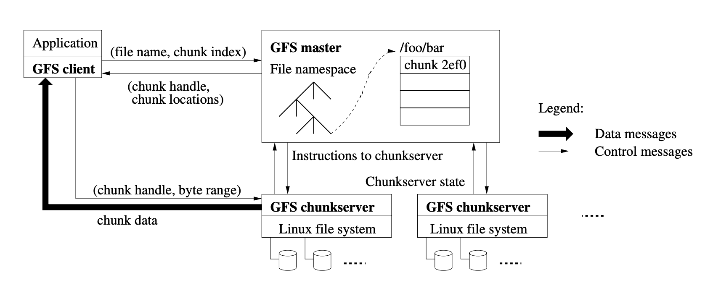

# Lecture03：Google File System

> 这是MIT6.824分布式系统课程的Lecture3，以google的文件系统GFS为例讲了分布式文件系统的一些内容，总的来说就是一篇GFS的阅读笔记

## GFS简介

### 总体设计原则

谷歌文件系统GFS是一个面向大规模分布式数据密集型应用的分布式文件系统，提供了建立在廉价设备之上的容错机制以及高扩展性和可用性。同时在设计的过程中为了**适应Google公司实际的场景**，对传统的文件系统设计模式作出了很多改进，主要有：

- 将组件的failure看成一种很常见的现象而不是可能发生的异常，因为整个文件系统运行在廉价的设备上，很难避免各种各样failure的发生，GFS考虑到了应用程序bug，操作系统bug，磁盘，内存和网络可能会产生的各种错误，设计了一整套不断监测，错误发检测，容错容灾和自动恢复的机制
- 从传统的标准来看GFS存储的文件是非常大的，多个GB的文件非常常见，每个文件中包含了很多饮用程序中的对象，但同时也有很多KB级别的小文件，因此I/O的参数和文件块的大小都必须重新考虑
- 很多文件操作都是在文件的末尾加上数据记录而不是覆写已有的数据，并且**随机的文件读写几乎不存在**，主要的文件操作就是在文件末尾添加数据，因此GFS将文件的append操作作为主要的性能优化点，并保证该操作的原子性
- 同时在设计文件系统的时候要为上层应用提供合适的api，因此GFS改进了一致性模型并新增了append原子操作

### GFS的设想

基于上述一些实际的Google业务场景和情况，GFS提出了如下设想以便更好地设计文件系统：

- 整个GFS建立在大量的廉价存储设备上，并且这些设备容易发生故障
- GFS会存储适量的超大文件并且需要针对性地进行读写优化，而小规模的文件数量很多但是不需要专门进行优化
- 文件读的方式主要是大规模的流式读(large stream read)和小的随机读，同时会有很多的顺序写操作(append)，一般写了之后就不会再更改写入的内容，但是也要支持小文件的随机写入
- 系统需要有良好的并发性能，支持多个客户端的访问，需要给并发的操作定义良好的语义，大致上采用生产者-消费者架构来管理文件的读写操作
- 高带宽比低延迟更重要，因为大部分应用程序都没有严格的响应时间要求，因此需要将注意力集中在数据的加载上，大部分程序都在花很多时间处理散装的数据

## GFS总体设计

### 用户接口

GFS提供了文件系统接口，虽然它没有实现像POSIX一样的标准化接口，GFS中的文件都在目录下层级化地组织并通过路径名进行区别。

GFS在提供了通用的open，close，read和write等接口的同时，新增了一个snapshot(快照)操作api，快照操作可以用很低的代价快速构建copy一份文件

### 总体架构

GFS运行在计算机集群上，每个GFS文件集群包括一个主服务器master和多个块服务器chunk server，并且可以被多个客户端访问。同时文件被分成了一系列块chunk，每一个chunk用一个**全局唯一的64位数字id**标识，这个id是在块被创建的时候分配的，为了文件数据的可靠性，每个文件数据进行了三副本备份操作，同时用户可以给每个级别的命名空间设定不同的备份数量。

主服务器负责维护文件系统中的元数据信息，包括文件系统的命名空间，访问控制信息，文件到块的映射关系和当前块所处的位置等，同时还控制块的租用，垃圾回收等操作，同时主服务器会定期和所有的块服务器进行通信来更新信息，这种通信采用的是心跳机制。

用于连接各个应用的客户端程序实现了文件系统的接口并且和主服务器，块服务器进行通信来完成文件的读写，但是客户端和主服务器只进行元数据的交互，涉及到具体文件数据的都在块服务器和客户端之间直接进行。同时客户端和块服务器上都没有文件数据的cache，因为发现这样的cache收效甚微，干脆取消来简化系统，而块服务器不需要文件数据的cahce是因为块服务器本地存储了很多文件，作为Linux机器自带了高效率的cache，不需要额外编写。

### Master服务器

单个主服务器的设计大大简化了GFS的设计，并且允许主服务器可以进行复杂的操作并拥有全局的知识，但同时我们在设计的时候也要**明确主服务器的功能边界**，不要让主服务器参与过多繁琐的事务，而是尽可能精简主服务器可以参与的功能，否则在大规模集群场景下，主服务器可能会成为整个文件系统的性能瓶颈。

因此GFS的设计是客户端从主节点处获取块服务器的关键信息，然后自己和块服务器建立连接进行文件的读写操作，同时客户端设置了缓存可以存储块服务器的位置信息，这样也可以减少主服务器的压力。

一般来说客户端操作的基本流程像上面的架构图中所示，可以概括为以下几个步骤：

- 客户端应用程序根据定长的块大小，用文件名和偏移量计算出目标文件要操作的块索引chunk index
- 然后客户端给主服务器发送一个请求，用文件名和块索引作为参数，主服务器返回目标文件对应的要操作的**块服务器以及其备份的地址**，并返回给客户端
- 客户端根据收到的地址选择一个最近的块服务器进行通信并完成读写操作，并在缓存中保存这些块服务器的信息，之后只要块服务器的位置不变，客户端要再操作对应的文件块就不需要再和主服务器进行通信。

### Chunk设计

块的大小是文件系统设计的一个非常重要的因素，GFS使用了64MB，这比起常规的文件系统块要大得多，并作为Linux上的明文文件存储。

使用比较大的块大小的好处有这样几点：

- 减少了客户端需要的和主服务器通信的次数，因为块的数量变少了
- 在一个大的块上可以进行更多的文件操作，可以减少维持一个持久TCP连接所需要的时间
- 可以减少主服务器存储的元数据的规模，主要还是因为块的数量变少了

但是另一方面大的块大小设计也有很多缺点。

### 元数据设计

元数据主要存储在主服务器中，主要有三种数据，分别是：

- 文件和块的namespace
- 文件和块之间的映射关系
- 每一个副本的位置

所有的元数据都存放在主服务器的内存中，同时前两种元数据会定期进行持久化操作并写进日志中，这些日志存在主服务器的磁盘中并进行多个备份，使用日志也可以很方便地进行维护，而块服务器的位置信息不会持久化地进行保存，而是通过定期询问块服务器获取实时的位置信息。

#### 内存中的数据结构

主服务器将元数据信息保存在内存中，这样一来主服务器的操作(Master Operation)就会非常迅速，同时也便于主服务器对元数据定期进行扫描和维护，主服务器对元数据的阶段性扫描可以实现垃圾回收，重备份，块服务器迁移等一系列操作。

一个可能的担忧是块服务器的数量可能会收到主服务器内存的限制，但事实上主服务器中给每个64MB大小的块使用的元数据结构小于64B，同时大部分的块都是满的，因为文件通常包含很多块，而只有少量的块没有被填满，主服务器在存储元数据的时候使用了**前缀压缩**。

#### 块位置

主节点中没有维护关于块服务器位置信息的持久性记录，而是通过定期轮询来获取块服务器的位置信息，同时通过“心跳”机制来监控块服务器是否失联。

一开始GFS的设计是将位置信息在主服务器中持久化保存，但是后来发现直接从块服务器中获取位置信息更加方便并且保证了主服务器和块服务器的同步。

#### 操作日志

操作日志记录了GFS中发生的重要元数据变动，需要在主服务器上进行持久化的存储，并且不能暴露给客户端，并进行多备份保证可靠性和防止丢失，在主服务器恢复的过程中，需要根据日志记录一步步重新执行。

同时为了尽可能减少不必要的操作，需要将日志尽可能保持在一个比较小的规模，这可以通过设立checkpoint的方式来实现，GFS的checkpoint是一种B+树结构，可以直接从磁盘映射到内存中，checkpoint中保存一些某个时间点下GFS的关键信息，并认为在这之前的所做的一系列操作已经安全了，一旦出现崩溃恢复不需要再按照日志一步步重新执行，这样一来就控制了日志的规模，加快了系统恢复的速度。

### 一致性模型

GFS使用了一个比较宽松的一致性模型，可以支持高并发量下的应用访问，但是相对简单而容易实现。GFS对整个文件系统的一致性做出了规定。

首先，文件命名空间的改变必须是原子的，这一操作主服务器互斥地执行，用命名空间锁来保证操作的原子性和正确性，同时主服务器的日志中定义了这些操作的顺序。

一个文件区域(File Region)在发生了数据突变之后的状态取决于突变的类型，下面这张表定义了不同数据突变操作下文件区域的各种一致性状态：

一致性的定义是：一个文件区域可以被所有的客户端不管从哪一个备份都能"看"到相同的数据，那么它就是一致的。如果一个区域在发生数据突变之后，所有的客户端会看见改变的数据是什么，那么这个文件区域是有定义的(Defined)，反之就是未定义的。当一个数据突变的操作在没有其他干扰下发生的时候，被影响的文件区域就是有定义的，而并发的操作可能会导致文件区域陷入未定义状态但是仍然保持一致性，所有的客户端可以看到一样的数据，但是未必能反应出任何一个突变的具体情况。

应用程序有判断文件区域是否有定义的机制，首先文件数据突变可以分成写和记录添加两种情况，写操作是将数据写到一个应用程序指定的偏移量中，而添加是直接在数据文件的末尾添加新的数据，为了让客户端的应用程序能够判别，会将文件操作的偏移量返回给客户端，客户端通过返回的偏移量和写的数据量来判断文件区域是否处于有定义状态。

对于一连串成功的数据改变，GFS保证被修改的文件区域的数据的可靠性，GFS实现这一保证的主要方式是：

- 对一个文件区域的所有备份都执行相同的操作
- 对块使用版本号进行管理，定期淘汰版本号落后的块

虽然但是，就算做好了一致性保证，仍然存在很多问题，比如集群节点的崩溃依然会导致数据的损毁和丢失，GFS通过主服务器定期和各个块服务器进行handshake来及时发现失效的块服务器并进行数据的恢复和转移。

## GFS设计细节

### 系统交互

### Master操作

### 容错机制

## 评价标准和实验结论